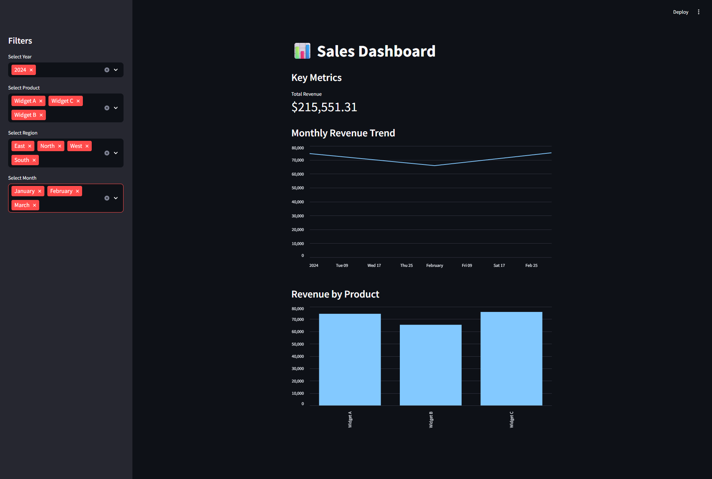
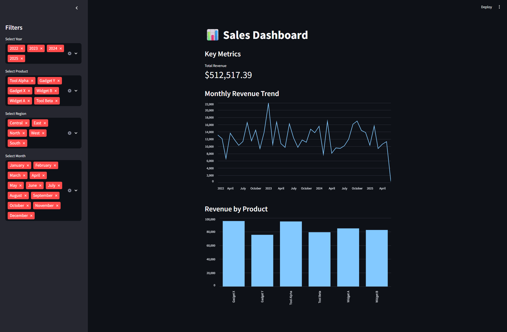
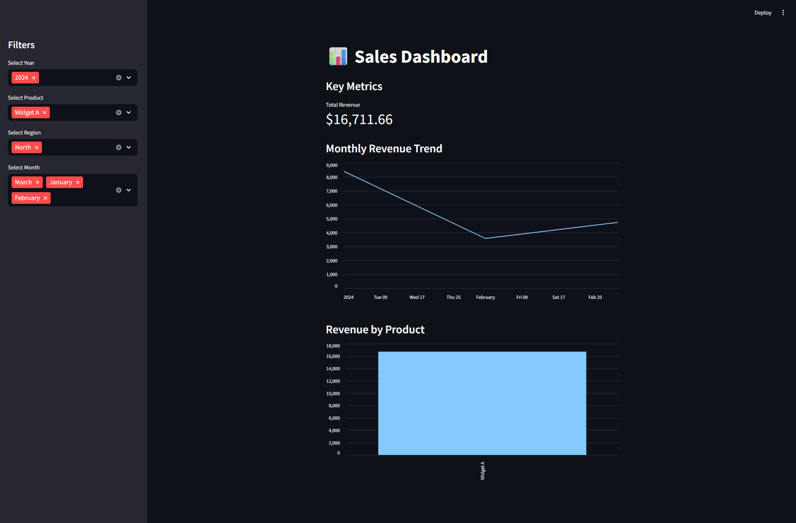

# 📊 Small Business Sales Dashboard

An end-to-end sales analytics tool for small businesses. Built with Python, SQLite, and Streamlit to provide quick, interactive insights into sales performance.

---

## 🚀 Features

- ✅ CSV ingestion via Python
- 🗃️ SQLite local database for lightweight storage
- 🔁 ETL scripts for easy transformation
- 📈 Streamlit dashboard with:
  - Filters by year, product, region, and month
  - KPIs: Total Revenue, Quantity Sold
  - Monthly trend chart
  - Revenue by product chart

---

## 📂 Project Structure

```
SalesDashboardExample/
├── data/                    # Raw or sample CSV files
├── screenshots/             # Portfolio screenshots
│   ├── full_dashboard.png
│   ├── more_data.png
│   ├── one_item_one_year.png
│   └── one_item_selected.png
├── scripts/                 # ETL scripts
│   ├── ingest_sales.py
│   └── transform_sales.py
├── dashboard.py             # Streamlit app
├── requirements.txt
├── sales.db                 # SQLite database (generated)
├── README.md
└── .gitignore
```

---

## 🛠️ Setup Instructions

### 1. Clone the repo

```bash
git clone https://github.com/alcow5/SalesDashboardExample.git
cd SalesDashboardExample
```

### 2. Install Python dependencies

```bash
pip install -r requirements.txt
```

### 3. Ingest sales data into SQLite

Make sure your CSV file is in the `data/` folder, then run:

```bash
python scripts/ingest_sales.py
```

### 4. Transform the raw data

```bash
python scripts/transform_sales.py
```

### 5. Launch the Streamlit dashboard

```bash
python -m streamlit run dashboard.py
```

> Open the local URL printed in the terminal to view your dashboard.

---

## 🖼️ Screenshots

### 📌 Full Dashboard View  


### 📊 With More Data  


### 🎯 One Item, One Year Selected  


### ✅ Filtered View (One Item Selected)  


---

## 📦 Requirements

- Python 3.10 or later
- pandas
- streamlit
- openpyxl

Install everything with:

```bash
pip install -r requirements.txt
```

---

## 🤝 Contributing

Pull requests welcome. For major changes, open an issue first to discuss what you’d like to improve.

---

## 📜 License

MIT License
